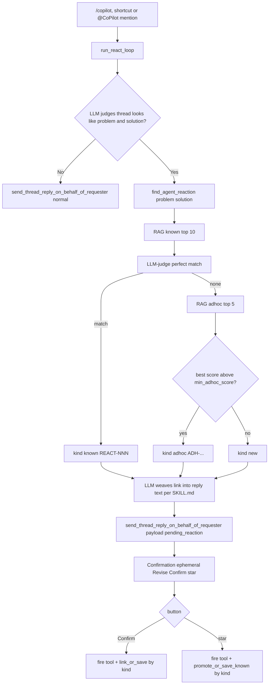

# M16 — Agent reactions (problem/solution memory)

[← Back to PRD](../../PRD.md)

## Story

When a Slack thread reaches a resolution — a bug is diagnosed, a question is answered, a decision is made — CoPilot should recognise the `{problem, solution}` shape, look up past similar resolutions, and either link this thread to a known reaction or save it as a new one. Over time the bot builds a per-skill library of canonical problem/solution pairs it can reference when drafting future replies (e.g. "we resolved this before — see REACT-042").

This replaces the current 👍 thumbs-up affordance ([`common/skill_thumbs_up/`](../../../common/skill_thumbs_up/)) with a richer ⭐ Perfect-match action backed by RAG, per [`docs/TODO.md`](../../TODO.md) — *"thumbs up — file system is not a good place — RAG is the right one"*.

- LLM instructions: [`skill_examples/define_problem_and_solution/SKILL.md`](../../../skill_examples/define_problem_and_solution/SKILL.md) **(to be added)** - LLM tool: [`common/tools/find_agent_reaction.py`](../../../common/tools/find_agent_reaction.py) **(to be added)**

## Terminology

| Term | Meaning |
|---|---|
| **agent reaction** | One persistent `{problem, solution, source_ref, links[]}` record. The repo's name for an AMPC "observation". |
| **known reaction** (`REACT-NNN`) | Curated, RAG-indexed entry under `agent_reactions/known/`. Holds the canonical text and a growing `links[]` of Slack instances. |
| **adhoc reaction** (`ADH-YYYYMMDD-<slug>`) | Candidate entry under `agent_reactions/adhoc/`. Promoted to known on the first ⭐ click. |
| **instance** | A `{channel_id, thread_ts, action_ts}` triple appended to a reaction's `links[]`. |
| **match kind** | `"known" | "adhoc" | "new"` — what `find_agent_reaction` returned for the current draft. |
| **library** | The whole tree under one skill folder: `agent_reactions/{known,adhoc,index}/`. |

## End-to-end flow



## Data model

### `known/REACT-NNN.md`

YAML front-matter + free-form body. The front-matter is the canonical record; the body is for humans.

```yaml
---
id: REACT-042
title: "Redis client timeout under burst load"
problem: |
  In #payments and #checkout, requests intermittently time out at the Redis client
  layer when traffic spikes above ~2k rps. Affects checkout latency p99.
solution: |
  Raise connection pool size from 50 to 200, set socket_timeout=2s, and add
  exponential backoff in the retry helper.
created_at: 2026-05-22T18:31:04Z
raw_thread_excerpt: |
  @alice: anyone else seeing 504s on checkout?
  @bob:  redis pool exhausted, see graph
  @carol: PR #1247 bumps it to 200
links:
  - { channel_id: C04XX, thread_ts: "1716400000.000100", action_ts: "1716400123.000200" }
  - { channel_id: C09YY, thread_ts: "1716480000.000300", action_ts: "1716480200.000400" }
---
```

### `adhoc/ADH-YYYYMMDD-<slug>.md`

```yaml
---
id: ADH-20260522-7f3a2c
problem: |
  Slack DM webhook fails with channel_not_found for guest users.
solution: |
  Resolve user via users.info first, fall back to im.open.
created_at: 2026-05-22T19:02:11Z
raw_thread_excerpt: |
  ...
source_ref:
  channel_id: C04XX
  thread_ts: "1716400000.000100"
  action_ts: "1716400123.000200"
known_id: null   # set to REACT-NNN once promoted
---
```

### `index/known.json`

Lightweight manifest scanned at startup; rebuilt on every write.

```json
[
  { "id": "REACT-042", "title": "Redis client timeout under burst load",
    "summary": "Pool exhausted under burst; bump to 200 + backoff.",
    "qdrant_point_id": "9b1d6c2a-...", "created_at": "2026-05-22T18:31:04Z" }
]
```

### `index/adhoc.json`

```json
[
  { "id": "ADH-20260522-7f3a2c", "summary": "DM webhook channel_not_found for guests",
    "qdrant_point_id": "1e7f...", "created_at": "2026-05-22T19:02:11Z" }
]
```

## Storage layout

Per-skill, under the existing skills tree:

```
~/.open_slack_copilot/skills/define_problem_and_solution/
  SKILL.md
  agent_reactions/
    known/REACT-NNN.md
    adhoc/ADH-YYYYMMDD-<slug>.md
    index/known.json
    index/adhoc.json
```

The library is **per skill** but the lookup tool is **global**: other skills may call `find_agent_reaction` too. v1 stores everything under the `define_problem_and_solution` skill folder; later skills can grow their own libraries by passing a different `skill_id` (resolved via [react_invocation_context](../../../common/tools/react_context.py)).

## RAG

- Embedder: existing [`get_embedder`](../../../common/rag/rag.py#L55-L59) (`BAAI/bge-small-en-v1.5`, dim 384).
- Two collections per skill:
  - `agent_reactions__reply__define_problem_and_solution__known`
  - `agent_reactions__reply__define_problem_and_solution__adhoc`
- Embedded text: `problem + "\n\n" + solution` (no title, no raw excerpt — keeps the embedding centered on the abstraction).
- Payload stored on each Qdrant point: `{ id, title?, summary, file_path }`.

## Tool: `find_agent_reaction`

Signature for the LiteLLM tool registration (parallel to [`SCHEDULE_PROMPT_TOOL`](../../../common/tools/schedule_tool.py#L13-L45)):

```python
{
  "type": "function",
  "function": {
    "name": "find_agent_reaction",
    "description": (
      "Look up past agent reactions for a {problem, solution} pair extracted "
      "from the current thread. Returns a match card the user will see on the "
      "confirmation ephemeral. Call ONCE per draft, only when the thread looks "
      "like a problem/solution discussion."
    ),
    "parameters": {
      "type": "object",
      "properties": {
        "problem": {"type": "string", "description": "1-3 sentence problem summary."},
        "solution": {"type": "string", "description": "1-3 sentence solution summary."},
        "raw_thread_excerpt": {"type": "string", "description": "5-15 lines verbatim from thread."}
      },
      "required": ["problem", "solution"]
    }
  }
}
```

`skill_id` is **not** an LLM-supplied argument; the handler reads it from [react_invocation_context](../../../common/tools/react_context.py) (the currently selected reply skill). Falls back to `"define_problem_and_solution"` if context doesn't carry one.

### Return shape

```python
{
  "kind": "known" | "adhoc" | "new" | "not_applicable",
  "id": "REACT-042" | "ADH-20260522-7f3a2c" | None,
  "title": "Redis client timeout under burst load" | None,
  "summary": "...",                     # 1-line summary
  "score": 0.91,                        # cosine similarity (known) or top-1 adhoc score
  "file_path": "~/.open_slack_copilot/.../known/REACT-042.md" | None,
  "url": None,                          # set when agent_reactions.base_url config is non-empty
  "candidates": [ ... ]                 # up to 3 next-best, for the LLM's awareness
}
```

The LLM passes this dict verbatim under `payload.pending_reaction` on the next `send_thread_reply_on_behalf_of_requester` call.

## Matching algorithm

1. **Known stage** — RAG over the known collection, top-k = 10 (config: `agent_reactions.known_rag_top_k`). One LLM-judge call decides whether *any* candidate is a perfect semantic match. Returns the matched `REACT-NNN` or `None`.
2. **Adhoc stage** (only if known stage missed) — RAG over the adhoc collection, top-k = 5 (config: `agent_reactions.adhoc_rag_top_k`). No LLM judge; top-1 candidate wins if its score ≥ `agent_reactions.min_adhoc_score` (default 0.55).
3. **New** — if both stages miss, return `kind="new"`.

The LLM-judge prompt (single call, model = same as agent loop):

```
You are matching a new {problem, solution} pair to a list of past known reactions.
Return the ID of the single best match if it is semantically the SAME problem and
solution (different wording is fine; different root cause or different fix is NOT).
Return null otherwise.

NEW PAIR:
  problem: <...>
  solution: <...>

CANDIDATES:
  1. REACT-042: problem=<...> solution=<...>
  2. REACT-077: ...
  ...

Respond with JSON: { "id": "REACT-042" } or { "id": null }.
```

## UI changes

`[common/slack/slack_bot/tool_confirmation.py](../../../common/slack/slack_bot/tool_confirmation.py)` changes:

1. **Agent-reaction card** — new helper `_agent_reaction_card_blocks(payload)` rendered between `_extra_params_section` and the message body when `payload["pending_reaction"]` is present.
   - `known`: `*REACT-042* · _Redis client timeout under burst load_`  newline  `Match 0.91 · `code` <file_path>`code``
   - `adhoc`: `*ADH-20260522-7f3a2c* · _closest match (0.78)_`  newline  one-line summary
   - `new`:   `_No similar problem/solution found yet — this will be saved as a new entry._`

2. **⭐ Perfect-match button** — added to `_actions_block` (line 150) when `pending_reaction` is present. Hidden otherwise.

3. **New constants** in [tool_confirmation.py](../../../common/slack/slack_bot/tool_confirmation.py):
   - `ACTION_TOOL_PERFECT_MATCH = "tool_confirm_perfect_match"`
   - `BLOCK_REACTION_CARD = "tool_confirm_reaction_card"`

4. **Handler** `handle_perfect_match_action(body)`:
   - Reuses `_resolve_confirmation_tool_text` and `_execute_confirmed_tool` for the underlying tool fire.
   - Then dispatches to `common.agent_reactions` based on `pending_reaction.kind`.

5. **Confirm handler** `handle_confirm_action` gets one extra line: after `_execute_confirmed_tool`, call `agent_reactions.on_confirm(pending_reaction, instance_ref)`.

## Side-effects table

| `pending_reaction.kind` | Confirm action | ⭐ Perfect-match action |
|---|---|---|
| `known` (REACT-NNN) | Fire tool + append instance to `REACT-NNN.links[]` | Same as Confirm (already known) |
| `adhoc` (ADH-…)     | Fire tool + append instance to that adhoc's `links` (or create new adhoc if LLM-supplied summary differs) | Fire tool + promote adhoc to a new `REACT-NNN` with this instance as first link |
| `new`               | Fire tool + save current `{problem, solution}` as a new adhoc | Fire tool + save current `{problem, solution}` directly as a new `REACT-NNN` |
| `not_applicable`    | Fire tool only (no save, no card) | Hidden (no ⭐ button) |

Promotion threshold = 1 by design; first ⭐ click on an adhoc promotes it. Not configurable in v1.

## New skill (sketch)

`skill_examples/define_problem_and_solution/SKILL.md` — same style as [`follow_up/SKILL.md`](../../../skill_examples/follow_up/SKILL.md):

```markdown
# Define problem and solution

 Install under `~/.open_slack_copilot/skills/define_problem_and_solution/`.
Loaded with other reply skills on **`@CoPilot`**, **Draft with CoPilot**, and **`/copilot`** runs.

## When this applies

When the thread looks resolved: a bug was diagnosed, a question was answered, a
decision was made, or the requester says "summarise what we did" / "save this".

## Steps

1. Extract `problem` (1-3 sentences) and `solution` (1-3 sentences) from the thread.
2. Call `find_agent_reaction(problem, solution, raw_thread_excerpt=<5-15 lines>)`.
3. Draft a thread reply via `send_thread_reply_on_behalf_of_requester`:
   - If kind=known: weave one line — "Similar to REACT-042 — see <file>."
   - If kind=adhoc: keep the draft factual; the ephemeral card prompts the user.
   - If kind=new: no extra wording.
   - Always pass the tool result verbatim as `payload.pending_reaction`.

## Tone

Terse, factual. No "as an AI" preamble.
```

## Capability map

| Step | Capability | Where it lives | Status |
|------|------------|----------------|--------|
| 1 | Invoke CoPilot in a resolved thread | Existing [`slack_listener_with_threads.py`](../../../common/slack/slack_bot/slack_listener_with_threads.py) | Implemented |
| 2 | Decide thread is problem/solution | **Native LLM** via system prompt + new SKILL.md | **To be done** |
| 3 | Extract `problem` / `solution` text | **Native LLM** | **To be done** |
| 4 | RAG against known + adhoc per-skill collections | New [`common/agent_reactions/agent_reactions.py`](../../../common/agent_reactions/agent_reactions.py) over [`common/rag/rag.py`](../../../common/rag/rag.py) | **To be done** |
| 5 | LLM-judge for perfect known match | New helper in [`common/agent_reactions/agent_reactions.py`](../../../common/agent_reactions/agent_reactions.py) using [`llm_client`](../../../common/llm/llm_client/llm_client.py) | **To be done** |
| 6 | Tool: `find_agent_reaction` | New [`common/tools/find_agent_reaction.py`](../../../common/tools/find_agent_reaction.py); register in [`_INTERACTIVE_TOOLS`](../../../common/slack/copilot_pipeline.py#L37-L46) | **To be done** |
| 7 | Carry `pending_reaction` through tool payload | Modify [`send_thread_reply_on_behalf_of_requester.py`](../../../common/tools/send_thread_reply_on_behalf_of_requester.py) | **To be done** |
| 8 | Ephemeral card + ⭐ button | Modify [`tool_confirmation.py`](../../../common/slack/slack_bot/tool_confirmation.py) (see [UI changes](#ui-changes)) | **To be done** |
| 9 | Confirm / ⭐ side-effects | New handler dispatching to [`common/agent_reactions/agent_reactions.py`](../../../common/agent_reactions/agent_reactions.py) | **To be done** |
| 10 | Promotion (adhoc → known) | `promote_adhoc` in [`common/agent_reactions/agent_reactions.py`](../../../common/agent_reactions/agent_reactions.py) | **To be done** |
| 11 | Reply skill SKILL.md | New [`skill_examples/define_problem_and_solution/SKILL.md`](../../../skill_examples/define_problem_and_solution/SKILL.md) | **To be done** |
| 12 | Replace 👍 with ⭐ everywhere | Delete [`common/skill_thumbs_up/`](../../../common/skill_thumbs_up/); update [PRD](../../PRD.md), [ai_docs/prd.md](../../../ai_docs/prd.md) | **To be done** |

## Config additions

In `config/*.yaml` (next to `rag.cross_channel`):

```yaml
agent_reactions:
  known_rag_top_k: 10
  adhoc_rag_top_k: 5
  min_adhoc_score: 0.55
  base_url: ""        # optional; if non-empty, file_path becomes base_url + relative path
```

## Tests (acceptance scenarios)

Unit:

- `find_match` returns `kind=known` when LLM-judge picks one of the top-10.
- `find_match` returns `kind=adhoc` with the top-1 candidate when its score ≥ `min_adhoc_score`.
- `find_match` returns `kind=new` when no adhoc clears the threshold.
- `promote_adhoc` writes a fresh `REACT-NNN.md`, removes / nulls the adhoc, and re-indexes.
- `link_instance` is idempotent for the same `{channel_id, thread_ts, action_ts}` triple.
- ID generation: `REACT-` sequence is gap-free per skill; `ADH-` uses date + 6-char random hash.

Integration (mock LLM + Slack):

- Resolved thread → `find_agent_reaction` returns `new` → Confirm saves adhoc → re-run with same thread → `kind=adhoc` with score ≥ threshold.
- Same as above + ⭐ on second run → promotes adhoc to `REACT-001` → third run on a similar thread → `kind=known`.
- The confirmation ephemeral renders the card for each kind; ⭐ is hidden when `kind=not_applicable` or `pending_reaction` is absent.

## Non-goals (v1)

- No watcher-kind auto-capture skill (depends on M4).
- No negative-learning ("👎") affordance.
- No editing of known reactions through Slack — humans edit the markdown directly.
- No cross-skill retrieval — each skill's library is isolated.
- No multi-step revision of `problem` / `solution` text post-save.

## Open / explicit defaults

- Matching uses LLM-judge for known stage (one extra LLM call per qualifying draft). Switching to a pure cosine-threshold mode is a later config flag.
- `kind=new` Confirm = save adhoc, ⭐ = save directly as known. Optimistic; user can delete files manually if they regret it.
- `pending_reaction` is opt-in: only the `define_problem_and_solution` SKILL.md tells the LLM to attach it.

## Related milestones

- [M1.2 — Reply skills](../m1_slash_command/m1_2_reply_skills.md) — progressive disclosure host.
- [M15 — Follow-ups use case](../m15_follow_ups_use_case/m15_follow_ups_use_case.md) — sibling reply-skill use case.
- [M4 — Watch channels and match skills](../m4_watch_channels_match_skills/m4_watch_channels_match_skills.md) — future watcher-kind auto-capture.
