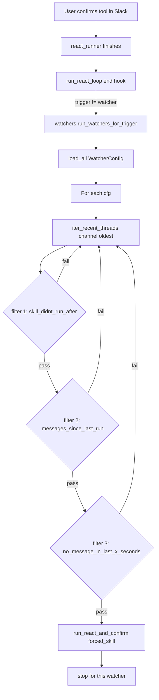

## Fixes needed in this plan
- confirmation of tools tranlastes to sign of online in copilot which tirogger watchers
- also confirnation of tools of watchers, no need to track trigger as diplayed in the diagram


## Layout

New folder `common/watchers/` containing:

- [common/watchers/watcher_config.py](common/watchers/watcher_config.py) — frozen dataclass + `validate_watcher_config(raw: dict)` (validate-then-act). Fields exactly match the user spec:

```python
@dataclass(frozen=True)
class WatcherConfig:
    name: str
    trigger: str  # only "any_tool_confirmation" supported for now
    requester_user_id: str
    channel_id: str
    run_skill_id: str
    thread_started_after: int  # seconds
    skill_didnt_run_after: int
    thread_had_more_than_x_messages_since_last_skill_run: int
    no_message_in_last_x_seconds: int
```

Validation: required fields non-empty; ints non-negative; `run_skill_id` must satisfy `progressive_disclosure.is_safe_skill_folder_name`; `trigger == "any_tool_confirmation"`.

- [common/watchers/watchers_root.py](common/watchers/watchers_root.py) — `watchers_root() -> Path` (`~/.open_slack_copilot/watchers`); `load_all() -> list[WatcherConfig]` reading `*.json`, logging and skipping invalid files.

- [common/watchers/eligible_thread_finder.py](common/watchers/eligible_thread_finder.py) — pagination over `conversations.history` to enumerate parent messages whose `ts >= now - thread_started_after`, plus `conversations.replies` per candidate. Mirrors the user's snippet but uses `slack_api.get_client()`:

```python
def iter_recent_threads(channel_id: str, oldest: float):
    client = slack_api.get_client()
    cursor = None
    while True:
        kwargs = {"channel": channel_id, "oldest": str(oldest), "limit": 200}
        if cursor: kwargs["cursor"] = cursor
        res = client.conversations_history(**kwargs)
        for m in res.get("messages", []):
            ts = m.get("thread_ts") or m.get("ts")
            if not ts: continue
            yield ts, m
        cursor = (res.get("response_metadata") or {}).get("next_cursor")
        if not cursor: return
```

- [common/watchers/watchers.py](common/watchers/watchers.py) — `find_first_eligible_thread(cfg)` and `run_watchers_for_trigger(trigger="any_tool_confirmation")`. The picker stops at the first thread for which all three filters pass (in this order, cheapest first):

  1. **`skill_didn't_run_after`** — query `skill_runs` (see below) for the most recent run for `(cfg.run_skill_id, cfg.channel_id, thread_ts)`. If it exists and `now - last_run_ts < skill_didn't_run_after` → skip.
  2. **`thread_had_more_than_x_messages_since_last_skill_run`** — fetch thread via `slack_api.read_thread(cfg.channel_id, thread_ts)`. Count messages with `float(m["ts"]) > last_run_ts` (or all messages if no prior run). If count `<` threshold → skip.
  3. **`no_message_in_last_x_seconds`** — last message ts from the same fetched thread; if `now - last_msg_ts < threshold` → skip.

  When a thread passes, call:
  ```python
  run_react_and_confirm(
      channel_id=cfg.channel_id, thread_ts=thread_ts,
      recipient_user_id=cfg.requester_user_id,
      prepare_user_id=cfg.requester_user_id,
      user_text="",
      context_kind="thread",
      forced_skill_folder=cfg.run_skill_id,
      copilot_trigger="watcher", copilot_action=f"watcher:{cfg.name}",
  )
  ```
  and stop (one watcher run picks at most one thread).

- [common/watchers/watchers_unit_test.py](common/watchers/watchers_unit_test.py) and [common/watchers/watchers_integration_test.py](common/watchers/watchers_integration_test.py) — mock Slack + LLM per project rules.

## skill_runs query helper

Extend [common/skill_runs/skill_runs.py](common/skill_runs/skill_runs.py) with a thread-scoped lookup (the current API is key-based only):

```python
def find_latest_run(skill_id: str, channel_id: str, thread_ts: str) -> dict | None:
    rows = (r for r in _collection().values()
            if r.get("skill_id") == skill_id
            and r.get("channel_id") == channel_id
            and r.get("thread_ts") == thread_ts)
    return max(rows, key=lambda r: r.get("action_ts") or "", default=None)
```

This requires a tiny extension to the file backend: confirm/extend `KeyValueCollection.values()` (or `iter_rows()`). Brief peek at [common/data_layer/file_key_value_collection.py](common/data_layer/file_key_value_collection.py) before writing — add `values()` if missing.

`last_run_ts` is parsed from `action_ts` (ISO-8601) via existing `common/date_utils.py` helpers.

## Hook into "any tool confirmation"

The trigger fires when a user confirms a tool in Slack and the resulting skill run completes. Hook point: end of [common/slack/copilot_pipeline.py](common/slack/copilot_pipeline.py) `run_react_loop` (right after `agent_log.append_entry(entry)`), guarded so the watcher itself doesn't recurse:

```python
from common.watchers import watchers
if copilot_trigger != "watcher":
    watchers.run_watchers_for_trigger("any_tool_confirmation")
```

Run synchronously for v1 (matches scheduled_prompts style); add a TODO for moving to a background queue if it gets slow.

## CLI / Make targets (parity with `scheduled_prompts`)

Add `watchers_list` and `watchers_run_once` make targets that call thin entry points in `common/watchers/watchers.py`:

- `watchers_list` — print each watcher config + last matched thread (if any).
- `watchers_run_once` — invoke `run_watchers_for_trigger("any_tool_confirmation")` once.

## Example config

`~/.open_slack_copilot/watchers/summarize_active.json`:

```json
{
  "trigger": "any_tool_confirmation",
  "requester_user_id": "U123ABC",
  "channel_id": "C0123ABC",
  "run_skill_id": "summarize_thread",
  "thread_started_after": 604800,
  "skill_didnt_run_after": 7200,
  "thread_had_more_than_x_messages_since_last_skill_run": 3,
  "no_message_in_last_x_seconds": 3600
}
```
(`name` is derived from filename stem.)

## Data flow



## Assumptions (made because clarifying questions were skipped)

- **Trigger model**: `any_tool_confirmation` = post-hook at end of `run_react_loop` for any non-watcher run. (Not a periodic timer.)
- **Skill invocation**: `run_react_and_confirm` with `forced_skill_folder=run_skill_id`; `requester_user_id` from config is both the prepare and recipient user.
- **Watcher loop is synchronous** in v1 (small N expected); easy to move off-thread later.
- **Recursion guard**: skip watcher evaluation when the just-finished run is itself a watcher (`copilot_trigger == "watcher"`).

If any of these don't match your intent, tell me and I'll revise before implementation.
